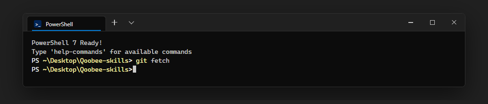

# terminal-screenshot

将终端命令输出渲染为逼真的 PNG 截图。支持 PowerShell、macOS zsh、Linux/SSH 等高保真模板，自动配置渲染工具，并按时间分区保存输出。

Render terminal command output as realistic PNG screenshots. High-fidelity templates for
PowerShell, macOS zsh, Linux/SSH, auto-configuring rendering tools, and time-partitioned
outputs.

## 快速示例 / Quick Example

```bash
python terminal-screenshot/scripts/html_to_png.py example.html --name git-fetch-powershell
```



> Windows Terminal PowerShell 7 风格，通过 Playwright 生成。内容：`git fetch` 终端会话模拟。
>
> Windows Terminal PowerShell 7 style, generated via Playwright. Content: a simulated
> `git fetch` terminal session.

## 支持的终端类型 / Supported Terminal Types

| 类型 / Type | 风格 / Style | 效果 / Effects |
|-------------|-------------|----------------|
| 绿色荧光 CRT | 黑 + 绿 `#33FF33` | 扫描线、发光、暗角 |
| 琥珀色荧光 CRT | 黑 + 琥珀 `#FFB000` | 扫描线、发光、暗角 |
| Windows Terminal PowerShell 7 | `#0C0C0C` + PowerShell token colors | 标签栏、窗口按钮 |
| macOS Terminal zsh | `#1D1F21` + zsh prompt colors | 红绿灯按钮 |
| Linux/SSH server | `#0B1020` + SSH prompt colors | 远程会话或无边框片段 |
| 现代暗色 (GNOME) | `#1E1E1E` + `#D4D4D4` | 简洁 |
| xterm 亮色 | 白 + 黑 | 简洁 |

> | Type | Style | Effects |
> |------|-------|---------|
> | Green Phosphor CRT | Black + Green `#33FF33` | Scanlines, glow, vignette |
> | Amber Phosphor CRT | Black + Amber `#FFB000` | Scanlines, glow, vignette |
> | Windows Terminal PowerShell 7 | `#0C0C0C` + PowerShell token colors | Tab bar, caption buttons |
> | macOS Terminal zsh | `#1D1F21` + zsh prompt colors | Traffic light buttons |
> | Linux/SSH server | `#0B1020` + SSH prompt colors | Remote session or borderless snippet |
> | Modern Dark (GNOME) | `#1E1E1E` + `#D4D4D4` | Clean |
> | xterm Light | White + Black | Clean |

## 安装 / Installation

复制到 `~/.claude/skills/terminal-screenshot/`：

Copy to `~/.claude/skills/terminal-screenshot/`:

```bash
cp -r terminal-screenshot ~/.claude/skills/
```

## 渲染工具 / Rendering Tools

脚本自动按以下优先级获取渲染工具：

The script resolves rendering tools with this priority:

1. **自动配置 / Auto-config** — 尝试 `pip install playwright` + `playwright install chromium`（最多重试 3 次）/ attempts to install Playwright (up to 3 retries)
2. **降级 / Fallback** — 检测系统已有工具：Edge headless → Chrome headless → wkhtmltoimage / detects existing system tools
3. **跳过 / Skip** — 全部不可用时跳过截图，不阻塞工作流 / skips screenshots gracefully if nothing works

## 工作原理 / How It Works

1. **识别会话画像** — 判断 PowerShell、macOS zsh、Linux/SSH、短片段或完整会话
2. **选择高保真模板** — 来自 `references/terminal-types.md` 和 `references/html-templates.md`
3. **构建 HTML** — 使用 `references/html-templates.md` 中的模板
4. **转换为 PNG** — 通过 `scripts/html_to_png.py`，自动配置 → 质量检查 → 降级 → 跳过
5. **整理输出** — 默认保存到 `terminal-screenshot/outputs/YYYY-MM-DD/HHMMSS-name/`

> 1. **Detect session profile** — PowerShell, macOS zsh, Linux/SSH, snippet, or full session
> 2. **Select high-fidelity template** — from `references/terminal-types.md` and `references/html-templates.md`
> 3. **Build HTML** — using templates from `references/html-templates.md`
> 4. **Convert to PNG** — via `scripts/html_to_png.py` with auto-config → quality checks → fallback → skip
> 5. **Organize outputs** — defaults to `terminal-screenshot/outputs/YYYY-MM-DD/HHMMSS-name/`

## 文件结构 / File Structure

```
terminal-screenshot/
├── README.md
├── SKILL.md                    # Skill 指令 / Skill instructions
├── example.png                 # 样例输出 / Sample output
├── outputs/                    # 生成物目录（git 忽略，仅保留 .gitkeep）/ generated outputs (gitignored)
├── references/
│   ├── terminal-types.md       # 色板与检测规则 / Color palettes & detection rules
│   └── html-templates.md       # HTML/CSS 模板 / HTML/CSS templates
├── scripts/
│   └── html_to_png.py          # HTML→PNG 转换器 / converter with auto-config + fallback
└── assets/                     # 预留 / reserved
```

## 许可证 / License

MIT
